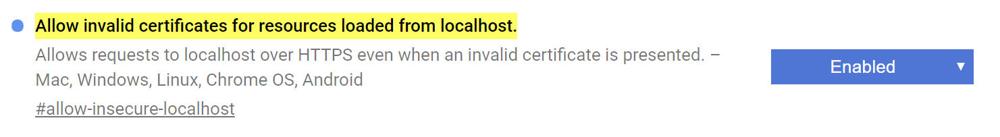

#   FalconJS.io - Boilerpate

A boiler plate for FalconJS Web Development Framework

## Getting Started

These instructions will get you a copy of the project up and running on your local machine for development and testing purposes. See deployment for notes on how to deploy the project on a live system.

### Prerequisites

What things you need to install the software and how to install them

```
npm i -g parcel-bundler
```

### Installing

To get this boilderplate running in development follow this steps inside the directory

- ```npm install ``` or yarn
- ```npm start ``` or ```yarn start```
- your browser will serve the FalconJS App
- Open up your favorite Editor and edit whats inside ```src``` folder


### PWA  [What is PWA?](https://developers.google.com/web/progressive-web-apps/) 
- This boilerplate is using CDN version of workbox
- edit the ```manifest.webmanifest``` to your liking
- edit the service worker file ```faconjs-sw.js```

### running on https to test PWA implementation
- ```npm run start:https```
- before doing you need to create a self signed certificate for Development purposes (this is not to be used in  production)

### Create a selfsign certificate
- run ```npm run cert:create```

### Allow self serve certificate from localhost on chrome
- on Chromes URL/Address Bar type in ```chrome://flags/#allow-insecure-localhost```
- Enable "Allow invalid certificates for resources loaded from localhost." as shown below
- 


##Enjoy deloping PWA with FalconJS!

### Build
 #### Ready to deploy?
 Let's Build
run ``` npm build ```
Your shinny new FalconJS App is contained in the ```dist``` folder

## License

This project is licensed under the MIT License - see the [LICENSE.md](LICENSE.md) file for details
